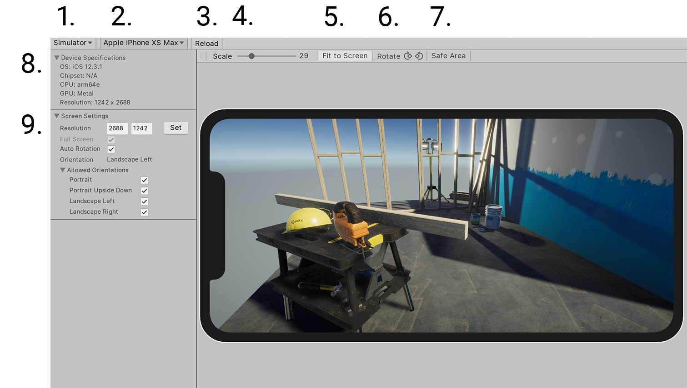

# **_Device Simulator_**

## **Overview**

Device Simulator is an alternative to the traditional Unity editor Game window. By simulating Screen and SystemInfo class behavior, Device Simulator aims to give an accurate picture of how an app will look on a device.

**Requirements**
- Compatible with Unity 2019.3 or above.

**Supported Features**
- [Screen](https://docs.unity3d.com/ScriptReference/Screen.html) class simulation.
- [SystemInfo](https://docs.unity3d.com/ScriptReference/30_search.html?q=systeminto) class simulation.
- Show precise screen shape, with notch and rounded corners.

## **Installing Device Simulator Package**
To install Device Simulator package, follow the instructions in the [Package Manager documentation](https://docs.unity3d.com/Packages/com.unity.package-manager-ui@latest/index.html).

You can access Device Simulator window in Unity Editor via
- Menu: **Window \> General \> Device Simulator**
- Menu: **Simulator** menu in Game view toolbar to switch to Device Simulator view.

## **Using Device Simulator**

#### 1. Game view mode
Switch between Game view and Simulator view.

#### 2. Device selection
Select from the available devices.

#### 3. Restart
Initialise simulation of Screen and SystemInfo classes using Player Settings without causing a domain reload.

#### 4. Scale
Controls how big the device appears inside the

#### 5. Fit to Screen
Automatically scale device to fit snugly inside the window.

#### 6. Rotate
Physically rotate the device. Depending on whether auto rotation is enabled or disabled, the actual picture may or may not rotate together with the device.

#### 7. Highlight Safe Area
Draw a border around the current [Screen.safeArea](https://docs.unity3d.com/ScriptReference/Screen-safeArea.html)

#### 8. Device Specifications
Shows the most important data of the currently simulated device:
- Device OS
- Device CPU/GPU
- Device Resolution

#### 9. Screen Settings
Allow viewing and changing the values of the Screen class.

#### 10. Player Settings
Device Simulator Player Settings override the real [Player Settings](https://docs.unity3d.com/2019.3/Documentation/Manual/class-PlayerSettings.html). Especially useful for those that don't have Android or iOS support installed. This menu includes all Player Settings that currently affect the simulation.
- Start in Fullscreen
- Resolution Scaling Mode
- Default Orientations
- Allowed Orientations
- Auto Graphics API
- Graphics API

**Use Player Settings** controls whether the real or simulated Player Settings are used.

#### 11. Preferences
You can access Device Simulator preferences by menu **Edit \> Preferences \> Device Simulator**, where you can
- Set the customized device directory, please make sure your device json files end with ".device.json".  
  Please reopen the Device Simulator window after setting the customized device directory.

## Document revision history
|Date|Reason|
|---|---|
|Oct 11, 2019|Document Updated. Matches package version 1.2.0-preview|
|Sep 26, 2019|Document Updated. Matches package version 1.1.0-preview|
|Sep 23, 2019|Document Updated. Matches package version 1.0.0-preview|
